# Static Website <Badge type="tip" text="html-css" />

Once we've finished Rust, we started to learn HTML and CSS by making a [static website](https://github.com/Rignchen/site-statique) for a fictional company, 
Our website needed to have at least:
- 4 pages including a home page
- A form
- A video
- A map that can be interacted with

I chose to make a website for a company that sells burgers called "Burger Paradise" 
For the form I imagined that if you aren't satisfied with the burgers suggested on the website, 
you can create your own burger inside a form and the company will make it for you.

### Figma
For this we started by using [Figma](https://www.figma.com/) to create a mockup of our website, 
there I designed all 4 pages:
- Home page 
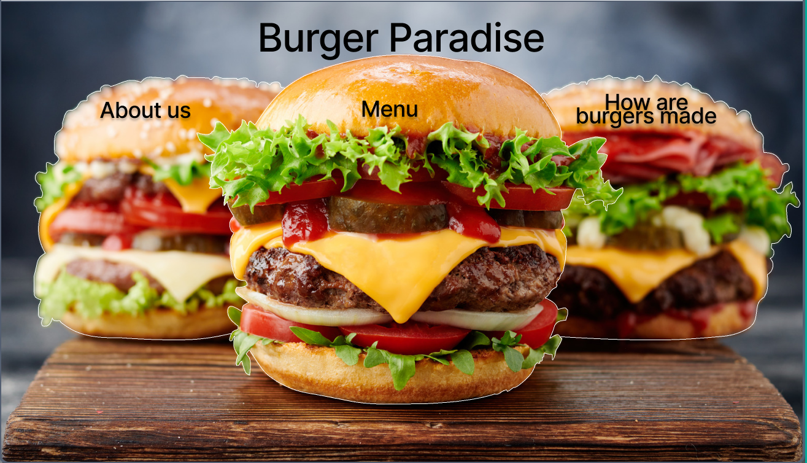
- Menu page 
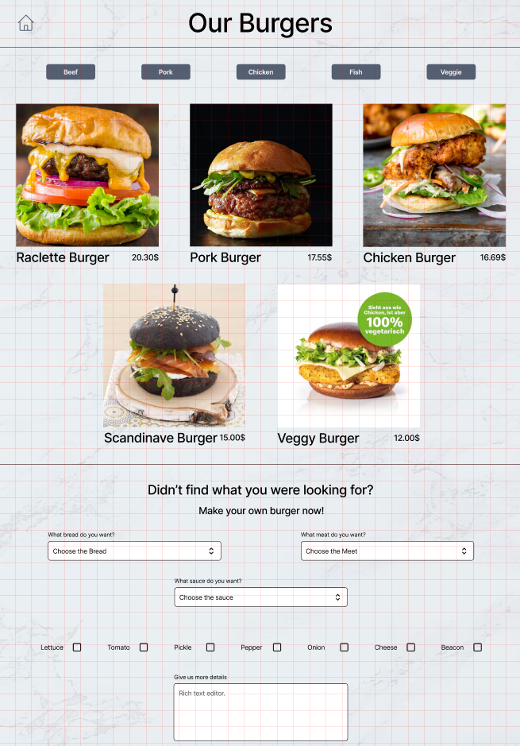
- Making off 
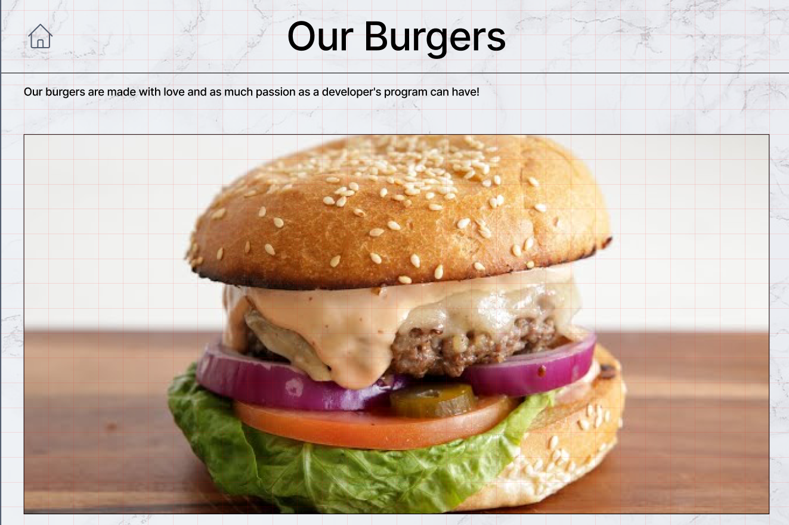
- About page 
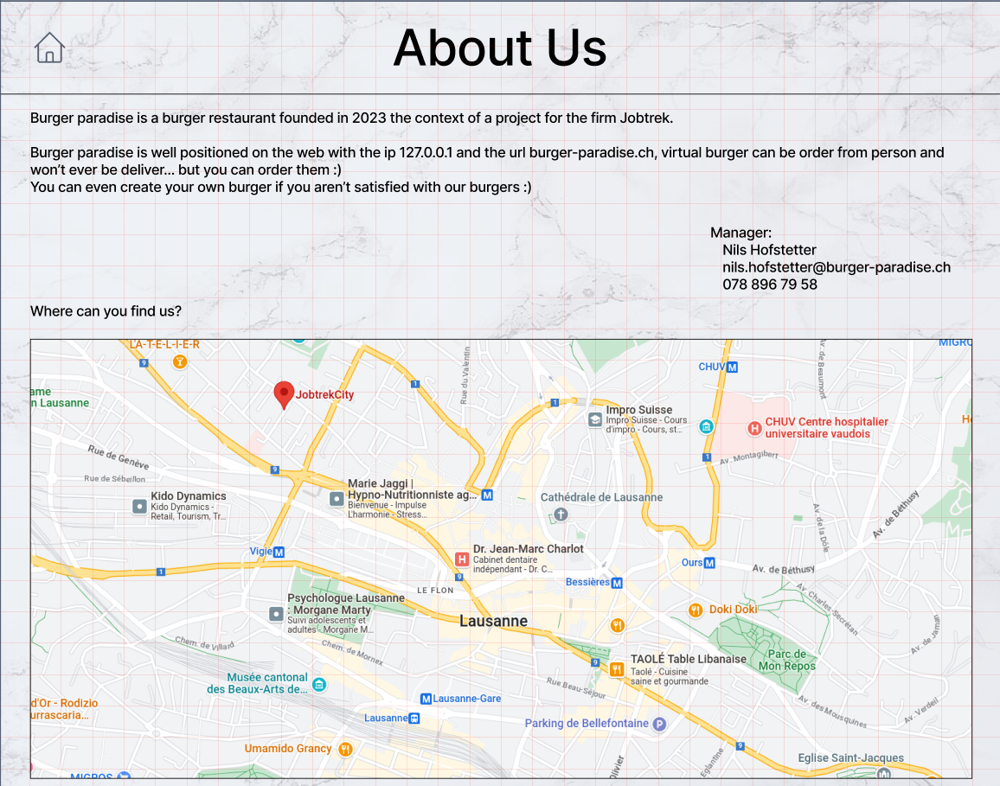

### HTML
Once the mockup was done, we started to code the website using HTML, this was the first time I used HTML, but I found it
quite easy use as you just need to write your text in the right place

At this point the website was just a bunch of text with no style, so it was pretty ugly,

    

        <h5 style="text-align: center; text-decoration: underline">Home page</h5>
        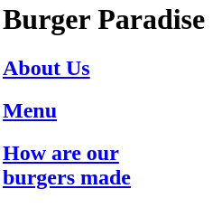
    

    

        <h5 style="text-align: center; text-decoration: underline">Menu page</h5>
        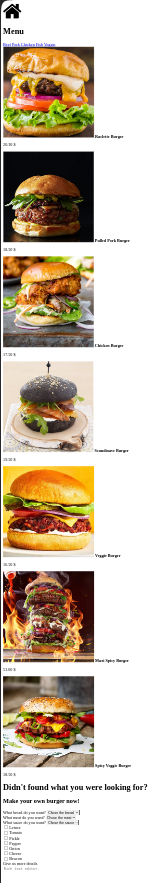
    

    

        <h5 style="text-align: center; text-decoration: underline">Making off</h5>
        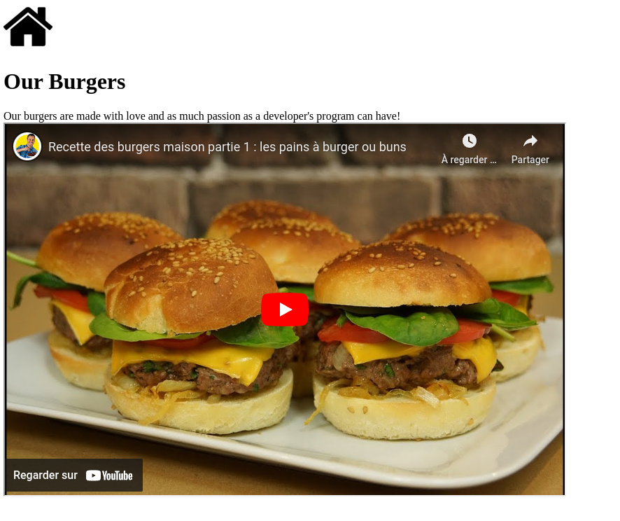
    

    

        <h5 style="text-align: center; text-decoration: underline">About page</h5>
        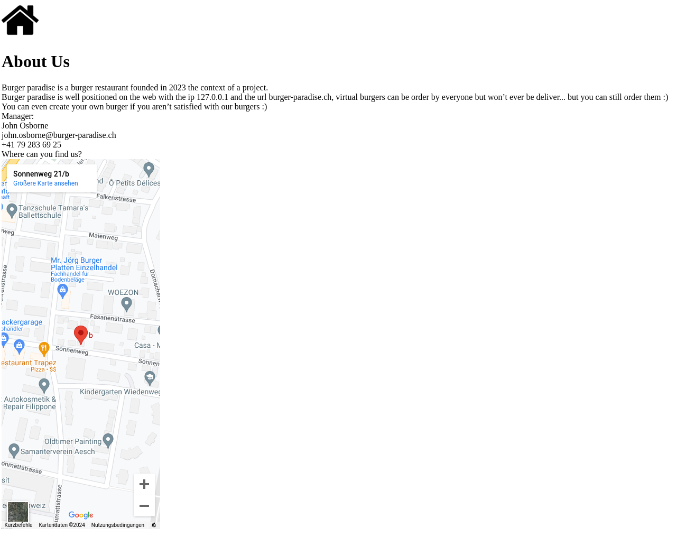
    

### CSS
To make the website look better, we used CSS to style it. It's at this point that I understood the definition of pain.
It didn't take me long to hate CSS as I can see no logic in it,
for me, it's just a bunch of rules that are applied to the elements, 
but most of the time the rule I just added doesn't display as it is overwritten by another rule that I didn't even know existed,
and sometimes changing the unit of a value can change if the rule is applied or not

At first, I wanted the burgers on the home page to be the buttons used to change the page, but It was too hard to do, 
so I just put a big square box on them and made the box the link

After a month of work, I finally finished the website and was really happy to start something else
- Home page 
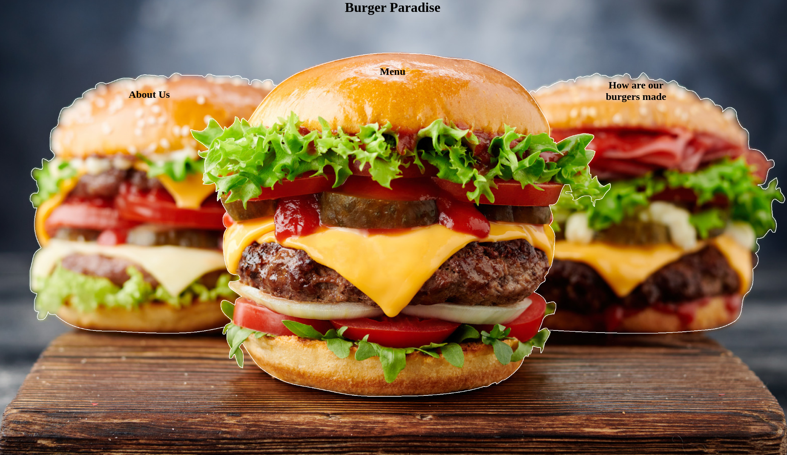
- Menu page 
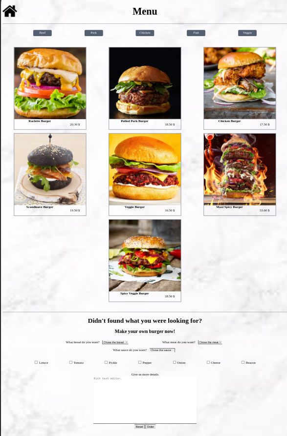
- Making off 
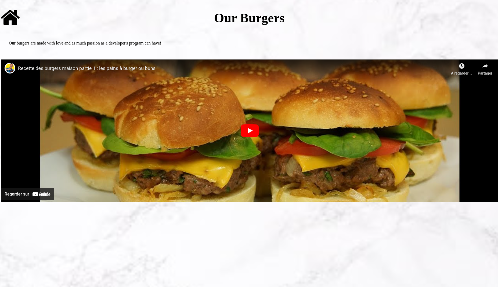
- About page 
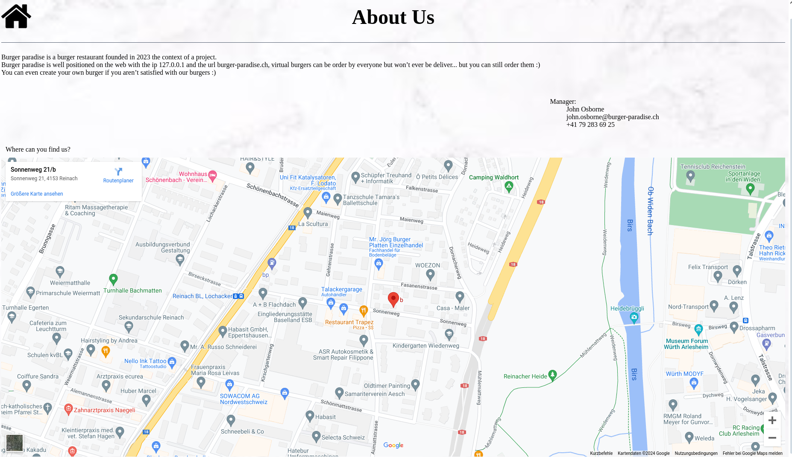

