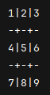
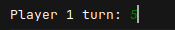
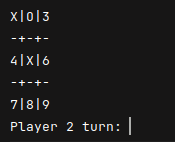
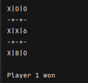
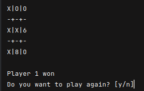

# Tic Tac Toe <Badge type="tip" text="Java" />

Once we learned about the basics of Java, we were tasked with creating a simple tic-tac-toe game using Java.\
I had already made a similar game using Python multiple times, so I had a good idea of how to approach the problem.

## Display the game board
I decided to use a 2D array to represent the game board, and then use a do while loop to keep the game running until a player won or the game ended in a draw.\
First thing I did was to create a method to print the game board from the 2D array, I did it using the stream I just learned.
```java
public static void main(String[] args) {
    //generate a list of list of character
    List<List<Character>> tableau = new ArrayList<>();
    for (int i = 0; i < 3; i++) {
        List<Character> row = new ArrayList<>();
        for (int j = 0; j < 3; j++) {
            row.add((char) (3 * i + j + '1'));
        }
        tableau.add(row);
    }
    is_playing = true;

    //main loop
    while (is_playing) {
        // TODO: make the code for the game to work
    }
}
public static String getBoard(List<List<Character>> tableau) {
    /*  X|X|X
        -+-+-
        X|X|X
        -+-+-
        X|X|X   */
    return tableau.stream()
        .map(row -> row.stream()
            .map(String::valueOf)
            .reduce("", (a, b) -> a + "|" + b)
            .substring(1))
        .reduce("", (a, b) -> a + "\n-+-+-\n" + b)
        .substring("\n-+-+-\n".length());
}
```
<br>

## Ask input to the user
Once this was done I added an ArrayList containing all the possible moves and added a method for the player to select one of the moves in the list.\
I then removed the selected move from the list so that the same move could not be selected again.
```java
//make a copy of the board called trigger, except all values are in the main list (will be used to check which case can be played)
var trigger = tableau.stream().flatMap(List::stream).collect(Collectors.toList());

//remove the value played from the trigger list so it can't be played again
trigger.remove(played);

public static String input(String text) {
    //Print the text, ask the user an input, return the input
    Scanner sc = new Scanner(System.in);
    System.out.print(text);
    return sc.nextLine();
}
public static Character inputIn(String text, List<Character> values) {
    //get an input from the user, check if the input is in values, return the input if it is, else ask again
    String input;
    do {
        input = input(text);
    } while (Objects.equals(input, "") || !values.contains(input.charAt(0)));
    return input.charAt(0);
}
```
<br>

## Know player's turn
I then wanted to know wich player's turn it was, so I added a variable type short to keep track of the turns, that way I could use the modulo operator to know wich player's turn it was.\
I then incremented the turn counter at the end of the while loop.
```java
static short turn;

turn++;
```

## Update the game board
Once I knew wich player was playing, I was able to change the character in the 2D array at the selected position by either an 'X' or an 'O'.\
Because I had a variable type short to keep track of the turns, I was also able to check if the game was a draw by checking if the turn counter was equal to 9.
```java
//update the board
var row = (played - '1') / 3;
var col = (played - '1') % 3;
tableau.get(row).set(col, (turn % 2 == 0) ? 'X' : 'O');
if (turn == 9) {
    is_playing = false;
}
```
<br>

## Winning condition
I then added a method to check if a player had won the game, this part did take me a while the first time I did a tic-tac-toe game but as it was the fifth time I was coding this game, I knew exactly how to do it.\
The idea is to have a method that checks all the possible winning combinations.\
In tic-tac-toe, there are exactly 8 possible winning combinations, 3 horizontal, 3 vertical and 2 diagonal.\
Because I had a 3/3 2D array, checking the horizontal and vertical combinations can easily be done in a single for loop.\
For the diagonal combinations, I had to check the two diagonals manually.
```java
static boolean player1won;
static boolean player2won;

private static void win(char value) {
    switch (value) {
        case 'X' -> player1won = true;
        case 'O' -> player2won = true;
    }
    is_playing = false;
}
private static void end(List<List<Character>> tableau) {
    for (int i = 0; i < 3; i++) {
        if (tableau.get(i).get(0) == tableau.get(i).get(1) && tableau.get(i).get(1) == tableau.get(i).get(2)) {
            win(tableau.get(i).get(1));
        }
        if (tableau.get(0).get(i) == tableau.get(1).get(i) && tableau.get(1).get(i) == tableau.get(2).get(i)) {
            win(tableau.get(1).get(i));
        }
    }
    if (
        (tableau.get(0).get(0) == tableau.get(1).get(1) && tableau.get(1).get(1) == tableau.get(2).get(2)) ||
        (tableau.get(0).get(2) == tableau.get(1).get(1) && tableau.get(1).get(1) == tableau.get(2).get(0))
    ) {
        win(tableau.get(1).get(1));
    }
}
```

## End the game
Once I knew which player had won, I had to display the winner and end the game which is easy, just a bunch of println
```java
System.out.println();
if (player1won) {
    System.out.println("Player 1 won");
} else if (player2won) {
    System.out.println("Player 2 won");
} else {
    System.out.println("Tie, nobody won");
}
```
<br>

## Play again
The problem was that once the game was over, the program would just end, so I put a do while loop in the main loop to ask the user if they wanted to play again.\
I also put all the code originally in the main loop in a method called play to keep it clean.
```java
public static void main(String[] args) {
    do {
        play();
    } while (inputIn("Do you want to play again? [y/n]", List.of('y', 'n')) == 'y');
}
```
<br>
