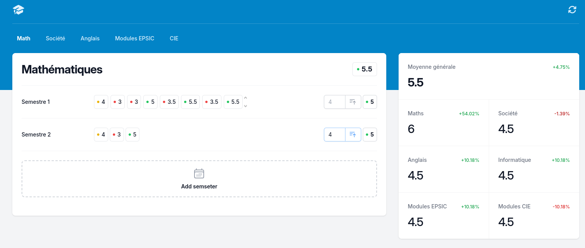

# Grade Calculator <Badge type="tip" text="Javascript" />

Once we knew how to use the DOM, we started to build a grade calculator. The idea was to only make the javascript part of the project, so our "teacher" gave us the html css for the webpage.

## Javascript
I started by implementing a function to add the grade elements in the semesters, I then made added a function to add new semesters and realised I had to code the function to add the grades in the semesters again because the semesters were now generated instead of being hardcoded.

Once this was done I calculated the average grade of the semesters, then I coded a calculated the average of the subjects.
I used the querySelector to get the list of the grades not to have to store them in variables.

Once this was done I implemented the ability to change subjects. Because I didn't want to make to code the same page again and again, I just empty the content of every semester and changed a variable to know which the current subject.

I then copied the subject average of the subject on the left of the page and calculated the difference old and the new average.\
I then calculated the global average of all subjects

## Angular tutorial
Once this was done, I started all over again but this time using Angular. At first, I thought I could just copy past my javascript code in the typescript files, and it would work, but I was wrong, when I did it, webstorm told me "this variable can be of type ___ and this is not assignable to type ___" every 2 lines.\
I then started to watch a tutorial on how to use Angular, I chose a recent one 'cause I knew Angular had changed a lot since it came out.\
The problem was that guy who made the tutorial didn't know how to use Angular, and he was explaining it wrong way to do things which made me lose a lot of time.\
Hopefully, my "teacher" saw what I was doing and told me that it was garbage, he then showed me how to use Angular, and I started all over again.\

## Angular
I then created a list of list of integers to store the grades, the idea was that each of these lists would be a semester, I then created a semester component and made it so that it would herit of the list of integers.\
I then created a grade component and made it so that it would herit of a number and display it.\
I then made it so that the semester component would display the grades and calculate the average of the grades.\
Once this was done I implemented the button to add semesters and the input to add grades.

Once it was done I extracted the subject in a component and gave him the list of list of integers.\
But then I had to implement a rooter to change the subject and I stuck on a problem as I'm not able to send data through the rooter.\
My "teacher" then helped me and told me I could use an Injectable class with public static variables to store the data and import it inside the components.

Once this was done I implemented the subject average and displayed it on the left of the page, but I got a problem as Angular automatically detect the changes in variables when you manually change them, but it didn't call the function to calculate the global average when the subject average changed.

My "teacher" didn't that, and we were stuck on this problem for a while until he remembered that Angular 17 added a new flow control system wich allowed to call a function when a variable changed.\
So I had to implement it which took me a while as all the code I had written wasn't ment to be used with this new system, plus for it to word I couldn't use a list of list of integers anymore, I had to make classes for the semesters and the subjects which also ended up in a lot of refactoring.

At the end I managed to make it work, but for some reason I still don't understand, the grade's border were now stuck on the grades instead of having a small padding, even tho I didn't change it.
