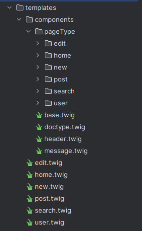

# Blog <Badge type="tip" text="PhP" />

Once the todo list done, our "Teacher" asked us to recreate a 4th version using a rooter 
but multiple people found it dumb to make a todo list with a rooter as there's only 1 page anyway,
so he said we could do whatever we wanted as long as we used a rooter and it was a CRUD in php.

I decided to make a blog as it seemed like a good idea to use a rooter for that as every post would have its own page.

## Setup

I started by creating a new project and installing the rooter with composer.

```bash
echo "<?php" > public/index.php
echo ".idea" > .gitignore
composer init
composer require slim/slim
composer require slim/psr7
composer require slim/twig-view
composer require twig/twig
```

## Rooter

I then decided to make a custom class for the rooter so that it would be easier to use.
```php
<?php
require_once __DIR__ . "/../vendor/autoload.php";
 
use Rignchen\SlimExemple\Logic\RoutingLogic;
 
RoutingLogic::init();
```

```php
<?php
 
namespace Rignchen\SlimExemple\Logic;
 
use Slim\Factory\AppFactory;
use Slim\Views\Twig;
use Slim\Views\TwigMiddleware;
 
class RoutingLogic {
    public static function init(): void {
        $app = AppFactory::create();
        $twig = Twig::create(__DIR__ . '/../../templates', ['cache' => false]);
 
        $twig->addExtension(new AddTwigExtensions());
 
        $app->addRoutingMiddleware();
        $app->addErrorMiddleware(true, true, true);
        $app->add(TwigMiddleware::create($app, $twig));
 
        Router::init($app);
 
        $app->run();
    }
}
```

```php
<?php
 
namespace Rignchen\SlimExemple\Logic;
 
use Psr\Http\Message\ResponseInterface as Response;
use Psr\Http\Message\ServerRequestInterface as Request;
use Slim\App;
use Slim\Views\Twig;
 
class Router {
    public static function init(App $app, Database $db): void {
        $app->get('/', function (Request $request, Response $response, $args) use ($db) {
            $view = Twig::fromRequest($request);
            return $response->write("Hello world");
        });
    }
}
```

## Database
Once the rooter was set up, I started by creating the database and the table for the blog posts.
```sql
create table if not exists 'users' (
    'id' integer primary key autoincrement,
    'username' varchar(50) not null,
    'password' varchar(100) not null,
    'email' varchar(100) not null,
    'gender' tinyint not null default 0,
    'avatar' varchar(100),
    'created_at' datetime not null default current_timestamp
);
create table if not exists 'posts' (
    'user_id' integer not null,
    'title' varchar(100) not null,
    'content' text not null,
    'created_at' datetime not null default current_timestamp,
    primary key ('title', 'user_id'),
    foreign key ('user_id') references 'users' ('id')
);
```

I made a class for the database and made it so it would be given to the rooter, that way I could use it in the rooter.
```php
class Database {
    private PDO $pdo;
    public function __construct(PDO $pdo) {
        $this->pdo = $pdo;
    }
}
```

I then added a class for the post and a class for the user.
```php
class Post {
    private int $user_id;
    private string $title;
    private string $content;
    private string $created_at;
 
    public function __construct(array $data) {
        $this->user_id = $data['user_id'];
        $this->title = $data['title'];
        $this->content = $data['content'];
        $this->created_at = $data['created_at'];
    }
}
```

```php
class User {
    private int $id;
    private int $gender;
    private string $username;
    private string|null $avatar;
    private string $email;
    private string $password;
    private string $created_at;
    private Database|null $db;
 
    public function __construct(array $data, Database|null $db = null) {
        $this->id = $data['id'];
        $this->gender = $data['gender'];
        $this->username = $data['username'];
        $this->avatar = $data['avatar'];
        $this->email = $data['email'];
        $this->password = $data['password'];
        $this->created_at = $data['created_at'];
        $this->db = $db;
    }
}
```

## CRUD
Once the basic structure was done, I started working on the CRUD (Create, Read, Update, Delete) functionnalities.\
I started by making the functionnality to create a post.
```php
public function create_post(User $user, string $title, string $content): void {
    $stmt = $this->pdo->prepare('insert into posts (user_id, title, content) values (:id, :title, :content)');
    $stmt->execute(['id' => $user->get_id(), 'title' => $title, 'content' => $content]);
}
```

Then I made the functionnality to read a post.
```php
public function get_post(int $user_id, String $postName): Post {
    $stmt = $this->pdo->prepare('select * from posts where user_id = :username and title = :postName');
    $stmt->execute(['username' => $user_id, 'postName' => $postName]);
    return new Post($stmt->fetch());
}
```

Then I made the functionnality to update a post.
```php
public function update_post(Post $post, String $newContent): void {
    if ($post->get_content() === $newContent) {
        return;
    }
    $stmt = $this->pdo->prepare('update posts set content = :content where user_id = :id and title = :title');
    $stmt->execute(['content' => $newContent, 'id' => $post->get_user_id(), 'title' => $post->get_title()]);
}
```

Then I made the functionnality to delete a post.
```php
public function delete_post(Post $post): void {
    $stmt = $this->pdo->prepare('delete from posts where user_id = :id and title = :title');
    $stmt->execute(['id' => $post->get_user_id(), 'title' => $post->get_title()]);
}
```

All these functions were just basically executing an sql request\
I just basically just get the post with the title and user id, then I can read, update or delete it.\
To create a post I just give the user id, title and content to the database.

## Interface
While working on the CRUD, I also made the interface for the blog.\
I didn't put much effort into it as it really only was there to show that the CRUD was working.\
However, I still wanted to keep it organized so I split it into multiple files.

I basically had a file for each pages wich was then calling a template file wich called header, success/error message and docktype files.\
This file was also calling a content file wich was then calling some other files to fill the content.
```
page.twig
├── base.twig
│   ├── docktype.twig
│   ├── header.twig
│   └── message.twig
└── .twig
    ├── content.twig
    ...
```
That way I had a base structure that was similar to every pages and if I wanted to change this structure it would change on every pages.

